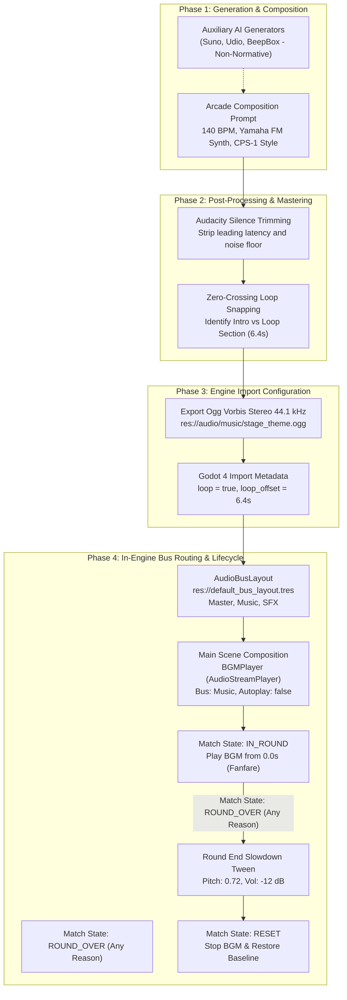

# Audio Asset Pipeline & Engine Bus Infrastructure Standard

This document establishes the authoritative standard for audio asset production, mastering, import configuration, and engine bus routing in **Retro Fighter**.

---

## 1. Overview & 4-Phase Audio Production Workflow

To deliver an authentic early-90s CPS-1 (Capcom Play System 1) / 16-bit arcade experience, all soundtrack and sound effect assets follow a deterministic 4-phase production lifecycle:



---

## 2. Phase 1: Generation & Composition Standard

### Normative Acoustic Profile
- **Tempo:** Strictly **140 BPM** for high-energy arcade fighting match pacing.
- **Sound Palette:** Yamaha FM synthesis profile emulation (YM2612 / YM2151 OPM sound chips):
  - Snappy, metallic 2-operator and 4-operator FM bass.
  - Bright FM brass / synth lead with fast attack and expressive vibrato.
  - 16-bit PCM rhythm section (punchy kick, crisp snare, metallic hi-hats).
- **Structure:**
  - **Opening Fanfare (0.0s – 6.4s):** Triumphant brass declaration, dramatic cymbals, and rising snare roll building anticipation during match intro.
  - **Looping Groove (6.4s onwards):** Relentless syncopated combat bassline and melodic hook designed to repeat seamlessly without harmonic drift.

### Non-Normative Guidance: Auxiliary AI Generators
> [!NOTE]
> The following generator instructions and prompts are provided as **non-normative guidance** for asset ideation and external tooling pipelines (such as Suno, Udio, or BeepBox):
>
> - **Prompt Formula:**  
>   `"140 BPM, 16-bit arcade fighting game theme, Capcom CPS-1 sound chip, Yamaha YM2151 FM synth brass, slap bass, energetic martial arts battle stage, high energy, punchy drums"`
> - **BeepBox / JummBox:** Use 4 FM channels (Lead, Harmony, FM Bass, Noise Drum channel) configured to 140 BPM with 4/4 meter.

---

## 3. Phase 2: Audacity Silence Trimming & Zero-Crossing Snapping

Mastering and post-processing ensure zero audio glitches or phase cancellation:
1. **Silence Removal:** Trim all pre-attack latency and silence from `0.0s` so the opening fanfare hits immediately on frame 0.
2. **Loop Marker Identification:** Locate the exact musical downbeat of bar 5 (at 140 BPM, exactly `6.4s`).
3. **Zero-Crossing Snapping:** Snap the loop point (`loop_offset`) and track termination strictly to zero-amplitude waveform crossings (`Z` key in Audacity) to eliminate click/pop artifacts during playback loops.
4. **Peak Normalization:** Normalize stereo master to `-0.5 dBFS` peak.

---

## 4. Phase 3: Godot 4 Ogg Vorbis Import Configuration

Audio files must be committed with their corresponding `.import` metadata files in version control.

### File Specifications
- **Format:** Ogg Vorbis (`.ogg`), Stereo, 44.1 kHz sample rate.
- **Quality:** Vorbis Quality 5/6 (approx. 160 kbps).
- **Asset Size Limit:** Must remain strictly under `< 2.5 MB` per track.
- **Location:** `res://audio/music/stage_theme.ogg`

### Import Settings (`res://audio/music/stage_theme.ogg.import`)
```ini
[remap]

importer="oggvorbisstr"
type="AudioStreamOggVorbis"
uid="uid://bl1g7r0tq1ogg"
valid=false

[deps]

source_file="res://audio/music/stage_theme.ogg"

[params]

loop=true
loop_offset=6.4
bpm=0.0
beat_count=0
bar_beats=4
```

- `loop = true`: Enables native looping in `AudioStreamOggVorbis`.
- `loop_offset = 6.4`: Ensures the initial playback includes the intro fanfare (`0.0s – 6.4s`), while subsequent loops wrap back directly to `6.4s`.

---

## 5. Phase 4: In-Engine Bus Routing & Scene Composition

### Bus Layout Structure (`res://default_bus_layout.tres`)
The engine defines three primary audio buses:
1. **`Master` (Bus 0):** Primary hardware output bus (`volume_db = 0.0`).
2. **`Music` (Bus 1):** Dedicated background music bus routed directly to `Master` (`send = &"Master"`).
3. **`SFX` (Bus 2):** Dedicated sound effects bus routed directly to `Master` (`send = &"Master"`, reserved for combat impacts, announcer voices, and UI pings).

### Scene Composition (`scenes/Main.tscn`)
The root game scene includes a dedicated background music player node:
- **Node Type:** `AudioStreamPlayer`
- **Node Name:** `BGMPlayer` (direct child of `Main`)
- **Properties:**
  - `stream = ExtResource("6_audio")` (pointing to `res://audio/music/stage_theme.ogg`)
  - `bus = &"Music"`
  - `autoplay = false` (playback is strictly orchestrated by match state)

### Match Lifecycle Audio Contract
- **Round Intro (`ROUND_INTRO`):** BGM remains silent or plays introductory fanfare.
- **Round Start (`IN_ROUND`):** `BGMPlayer.play()` begins playback from `0.0s`.
- **Round End (`ROUND_OVER`):** Any terminal condition (`KO`, `TIME_UP`, `DRAW`) smoothly tweens `pitch_scale` to `0.72` and `volume_db` to `-12.0 dB` over `0.9s`.
- **Reset (`RESET`):** BGM is stopped, and pitch (`1.0`) and volume (`0.0 dB`) are restored to baseline.
